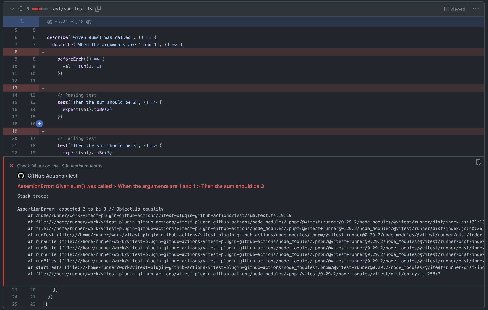

# vitest-plugin-github-actions

[](https://www.npmjs.com/package/vitest-plugin-github-actions)

> GitHub actions error and coverage reporter for vitest.

<br />

<a href="https://github.com/wip-elonehoo/vitest-plugin-github-actions/pull/1/files#diff-c6d11505ff539aa48ff575805de50cf3bacd78c276a1be8c7000ac22fe42ce51">
  
</a>

## Install

```bash
pnpm install --save-dev vitest-plugin-github-actions
```

## Config

```ts
// vitest.config.ts || vite.config.ts
// import { defineConfig } from 'vite'
import { defineConfig } from 'vitest/config'
import GitHubVitest from 'vitest-plugin-github-actions'

export default defineConfig({
  test: {
    reporters: process.env.GITHUB_ACTIONS
      ? ['default', new GitHubVitest()]
      : 'default',
  },
})
```

## Credits

Thanks to:

- [Vitest](https://github.com/vitest-dev/vitest)

- [@Anthony Fu](https://github.com/antfu)

- [@翠 / green/vitest-github-actions-reporter](https://github.com/sapphi-red/vitest-github-actions-reporter)

## License

[MIT](./LICENSE) License © 2023 [Elone Hoo](https://github.com/elonehoo)
